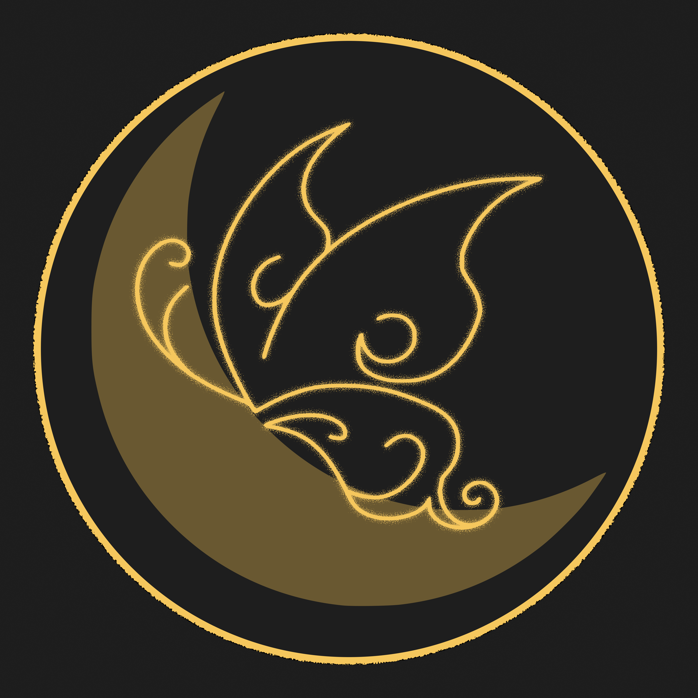
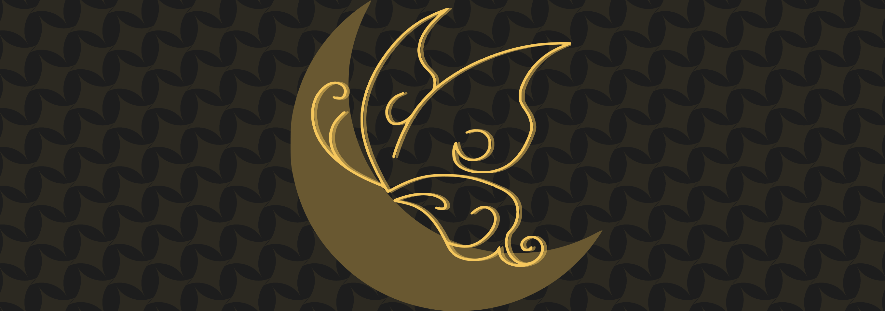

# Olá! Pode me chamar de Gui :P
Estudante de **Design** e desenvolvo um bot no meu tempo livre
sou iniciante na área de design, atualmente fico criando identidades visuais para os meus próprios projetos.

---

## 🎨 Projetos de Design & Identidade Visual

### 👤 Ícones de Perfil
| 🌙 Luna.js | ⚡ Light.js |
| :---: | :---: |
|    **Ícone de Perfil** |    **Ícone de Perfil** |

 

### 🖼️ Banners de Perfil
| 🌙 Luna.js | ⚡ Light.js |
| :---: | :---: |
|    **Banner de Perfil** |    **Banner de Perfil** |

---

## 💻 Linguagens de Programação

---

## 🌐 Links & Recursos

---

> ⚠️ **Nota:** O bot está em desenvolvimento contínuo. Funcionalidades, designs e comandos podem mudar a qualquer momento. Se encontrar algum problema, por favor reporte no servidor de suporte (o próprio bot possui o comando com o link direto).
