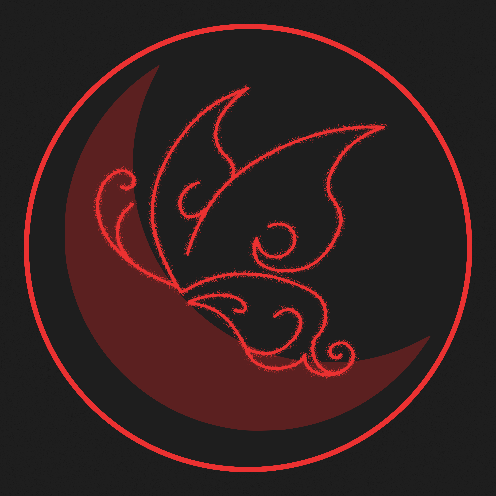
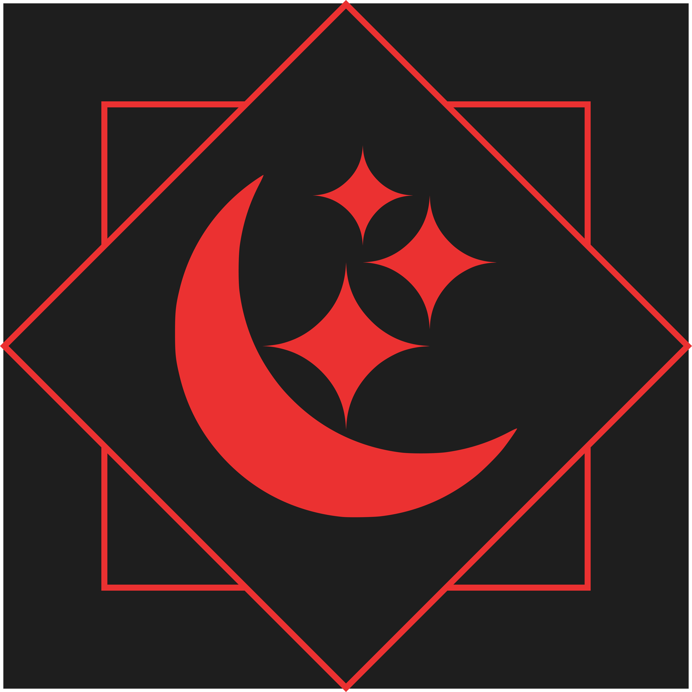
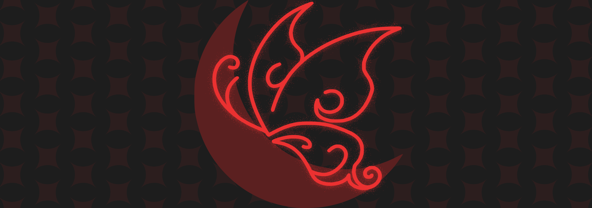
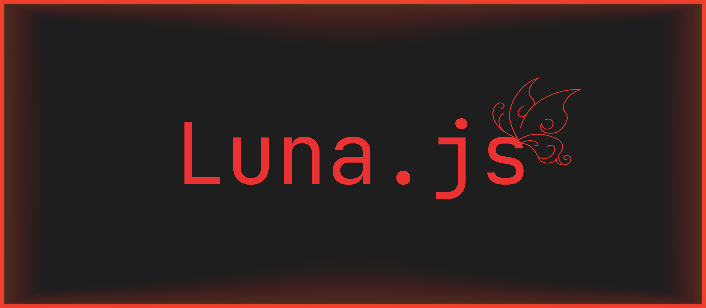

# Ayoooooo 💚
Estudo **Design** e no tempo livre desenvolvo um bot.
Sou iniciante na área, então por enquanto fico criando identidades visuais pros meus próprios projetos.

---

### ✦ Linguagens de Programação

---

### ✦ Links & Recursos

> ⚠️ **Nota:** O bot ainda tá em desenvolvimento, então funcionalidades e designs podem mudar a qualquer momento. Achou algum problema? Reporta no servidor de suporte (o bot tem um comando com o link direto).

---

| 🌙 Luna.js | 🖥️ Servidor |
| :---: | :---: |
|    **Ícone de Perfil** |    **Ícone do Servidor** |

 

| 🌙 Luna.js | 🖥️ Servidor |
| :---: | :---: |
|    **Banner de Perfil** |    **Banner do Servidor** |
